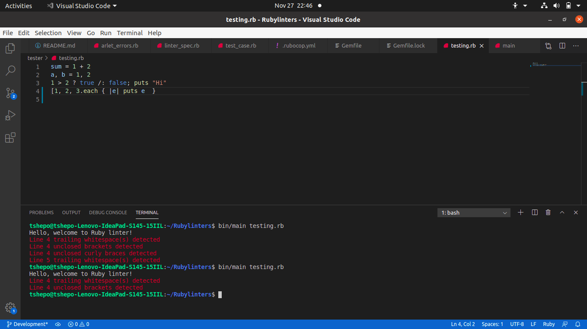

# Rubylinters

- In this project, I have built my own customized linter for ruby files. The
  main goal was to put into practice the main concepts of Object-Oriented
  Programming gained in the Microverse curriculum Ruby module. After reading the
  file to lint it is iterated through line by line for parsing and testing.


# Getting Started

- This linter will parse your file and find some errors as defined by
  [Ruby Style Guide](https://github.com/github/rubocop-github/blob/master/STYLEGUIDE.md)

# Following can be tested with this linter

- There should be no unpaired |, (, ), {, }, [, ].

- There should be no trailing whitespaces left.

- There should be no spaces after (, [ or before ], ).

- There should be no spaces after !.

- There should be spaces around operators, after commas, colons and semicolons,
  around { and before }.



## Example of good and bad code

```ruby
sum = 1 + 2
a, b = 1, 2
1 > 2 ? true : false; puts "Hi"
[1, 2, 3].each { |e| puts e  }
```

```ruby
some(arg).other
[1, 2, 3].length
```

```ruby
!array.include?(element)
```


# bad
```sum=1+2
a,b=1,2
class FooError<StandardError;end
```

# good

```sum = 1 + 2
a, b = 1, 2
class FooError < StandardError; end
```

## Spaces and Braces

- No spaces after (, [ or before ], ). Use spaces around { and before }.

# bad
```some( arg ).other
[ 1, 2, 3 ].each{|e| puts e}
```

# good
```some(arg).other
[1, 2, 3].each { |e| puts e }
```


## On your Computer

To get a local copy up and running follow these simple example steps.

### Prerequisites

- Any PC or device with an internet connection and ability to use the command
  line terminal

### Setup

- Open the command line terminal

### Install

- Go to your preferred directory
- Run `git clone https://github.com/TSHEPO-CLOUD/Rubylinters/tree/feature` command

### Usage

- Navigate to respective folder ( Rubylinters ), put the file you want to lint
  in 'data' folder (or copy your code into the 'testing. rb' file) and type
  `bin/main <your-file-name>` or `bin/main testing.rb` in your terminal.
- Result will be shown
- Follow the instructions above for the live link.


## Built with

- Ruby
- Ruby Gem 'Rainbow'

## Author

👤 **TSHEPO DAVID MOLEFE**

- GitHub: [@githubhandle](https://github.com/TSHEPO-CLOUD)
- Twitter: [@twitterhandle](https://twitter.com/tshepomolefem)
- LinkedIn: [LinkedIn](https://www.linkedin.com/in/tshepo-molefe-8153313b)

## 🤝 Contributing

Contributions, issues, and feature requests are welcome!

## Show your support

Give a ⭐️ if you like this project!

## Acknowledgments

- Ruby documentation
- [Ruby Guides](https://www.rubyguides.com/)

## 📝 License

This project is [MIT License](./LICENSE) licensed.
